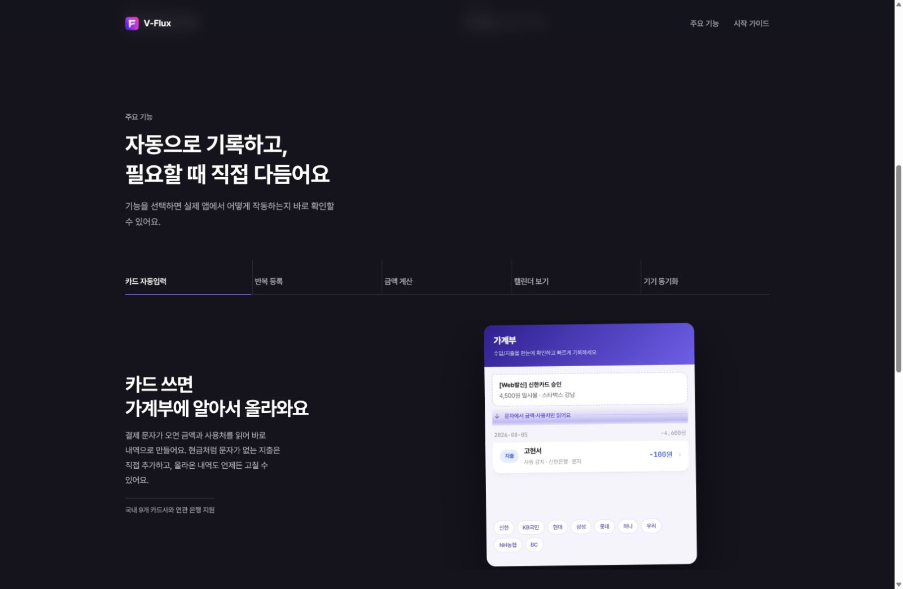

# V-Flux 소개 페이지

> **당신의 자산, 더 똑똑하게 흐르게** — .NET MAUI 기반 자산 운용(가계부) 애플리케이션 V-Flux의 소개 페이지입니다.

### 👉 [https://kohyeonseo.github.io/V-Flux-page/](https://kohyeonseo.github.io/V-Flux-page/)

이미지를 누르면 실제 페이지로 이동합니다.

## 링크

| 구분 | 주소 |
| --- | --- |
| 라이브 페이지 | https://kohyeonseo.github.io/V-Flux-page/ |
| 이 저장소 | https://github.com/KoHyeonSeo/V-Flux-page |

## 이 저장소는

V-Flux 앱의 소개 페이지 **한 장**만 담고 있습니다. 앱 소스 코드는 별도의 비공개 저장소에서 관리하며,
이 저장소는 GitHub Pages 배포만을 목적으로 분리되어 있습니다.

